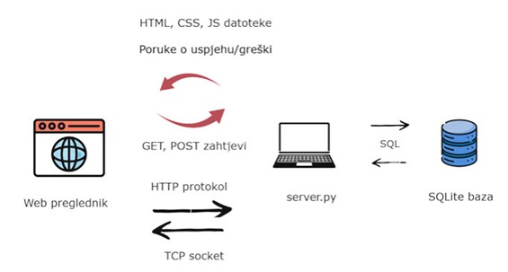

# Web Catalog Project

Project using Python socket and HTML/CSS/JS to implement a basic web catalog for the Advanced Computer Networks course at the Faculty of Organization and Informatics. 

# Installation

Pre-requisite: Python installed

From the root directory of the project, run the `db_setup.py` script via the command line to create the `web-catalog.sqlite` file and to seed the database with initial data about groceries and recipes:

```
python db_setup.py
```

This creates `web-catalog.sqlite` database with non-empty tables. Navigate to the `backend` directory and start the local server:

```
cd backend
python server.py
```

You can now access the application via a web browser at `http://localhost:8000`.

By using the navigation on the left side of the screen, you can navigate between pages. You can enter new groceries and recipes into the database using the forms.

Clicking on the grocery cards will display a page with recipes, but only those that contain the selected grocery (thanks to the query parameter).

Clicking on a recipe card will display the preparation instructions for that recipe.

# Requirements

The goal of this theme is to develop a server-side web application that manages client requests and returns appropriate web pages, essentially "from scratch," i.e., without using pre-made packages (frameworks) or modified socket libraries (e.g., WebSocket, etc.), and by using classic TCP or UDP sockets.

The server-side web application must be developed as follows:

- Classic TCP or UDP sockets should be used for communication with clients.
- Only the server-side application needs to be designed, while any web browser (Firefox, Chrome, Edge, etc.) should be used as the client application for testing.
For the purposes of this task, the socket needs to be set to the localhost IP address (usually: 127.0.0.1) and to any available port.
- Web pages need to be designed using HTML, CSS, and JavaScript if necessary, or you can use WYSIWYG tools for rapid web page development (e.g., BlueGriffon). It is important to note that the assessment will focus on the functionality, accessibility, and intuitiveness of your system. However, web pages must include images and hyperlinks for redirection to other pages, and it is highly recommended to use appropriate color combinations.
- The application must be able to handle POST and GET requests from clients.
- The web application operates as follows: Upon a specific user request, the application must return the corresponding web page formatted appropriately. In addition to simply viewing pages, the user must be able to interact with the application on at least one page, for example, by filling out a form (POST request), which the server-side application must be able to process.
- Proper parsing of requests and responses, as well as appropriate protocols, must be taken into account.
- The application must be multithreaded, and it is recommended to use the "thread per request" approach.
- For easier request processing tracking, the application must print in the console upon startup the IP address and port it is running on, and upon each incoming request, it must print from which IP address the request came, which request it is, and which response was sent to the request (200 OK, 404 Not found, etc.).
- No usage of frameworks or modified socket libraries (e.g., WebSocket). Only the basic socket library should be used, since the system must be designed "from scratch."

# Description

The theme of the web application is a web catalog of various groceries and recipes that can be created based on those groceries. The user has the ability to browse groceries and add them to the catalog via a form. Similarly, they have the option to browse recipes and add them via a form, where they can also include available existing groceries from the database in addition to instructions and other details in the recipe. When browsing groceries, they can click on any grocery card to get all the recipes (if any) that include that grocery, thus easily getting ideas on how to use up the remaining groceries they have in the fridge. Similarly, the user can click on any recipe card to get detailed preparation instructions.

The architecture is envisioned as a client-server architecture, where the client is represented by a web browser through which the application's interface or pages are accessed, and the server is a local machine running the server.py script. By running this script, a TCP socket is created on port 8000, to which requests for pages are received via the web browser. The client communicates with the server via the HTTP protocol by sending GET and POST requests, while the server receives client requests via sockets. In case of the need to retrieve or insert data into the database, the server communicates with the `.sqlite` file.

GET requests for pagesh are received at endpoints `/`, `/groceries`, and `/recipes`, and GET requests for data from the database that need to be displayed on the corresponding pages are sent to endpoints with the prefix `/api`, e.g., `/api/groceries`.

In the case of GET requests for a web page, the server constructs an HTML page that includes appropriate CSS files for styling the page and JS files for executing its logic on the client side. The server includes this page as text in the response according to the format required by the HTTP protocol and sends it to the client.

The client/web browser interprets the response according to the HTTP protocol and displays the requested page with included CSS and JS files. Since such a page does not display grocery or recipe data, upon loading the JS file in the background, it automatically sends GET requests to the appropriate `/api` endpoints for data that needs to be displayed on that page. The server retrieves the requested data from the SQLite database (`web-catalog.sqlite` file) and returns it via the socket as text in JSON format. The JS script converts the received data into appropriate HTML elements, thus populating the page's content.

When submitting a form with data about a new grocery or recipe, the client sends a POST request to the server, which then extracts the data from the request body and communicates with the database to execute the addition of a new object via SQL commands. It then sends a message to the client via the socket about the success or failure of the addition to the database. Upon receiving a message from the server, the client's JS script in the background executes another GET request for data at the `/api` endpoint and recreates the HTML element that is populated with that data, allowing the newly added grocery or recipe to be immediately visible on the page without the need to refresh it.

When the server is started, it listens for requests on the loopback address 127.0.0.1 and port 8000. If port 8000 is already in use, the port number is incremented by 1 until a free port is found. Once the server socket successfully binds to the IP address and port, the socket is opened for listening, and the server waits for a connection from a client.

When a request arrives from a client, that request is handled in a separate thread by creating a new thread that calls a request handling function to which the request and the socket descriptor are passed.



# Technologies

- Client-side: HTML, CSS, JavaScript
- Server-side: Python with basic socket library
- DBMS: SQLite

